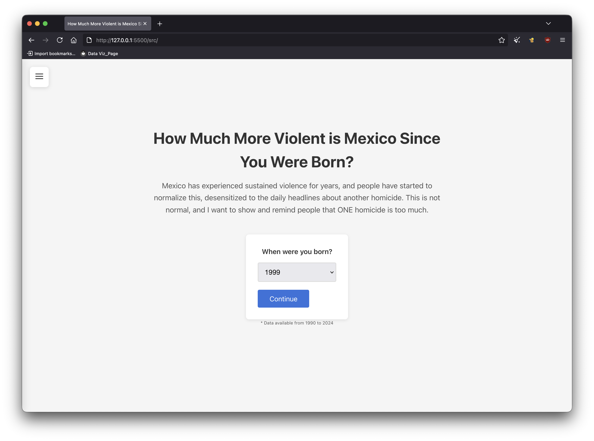
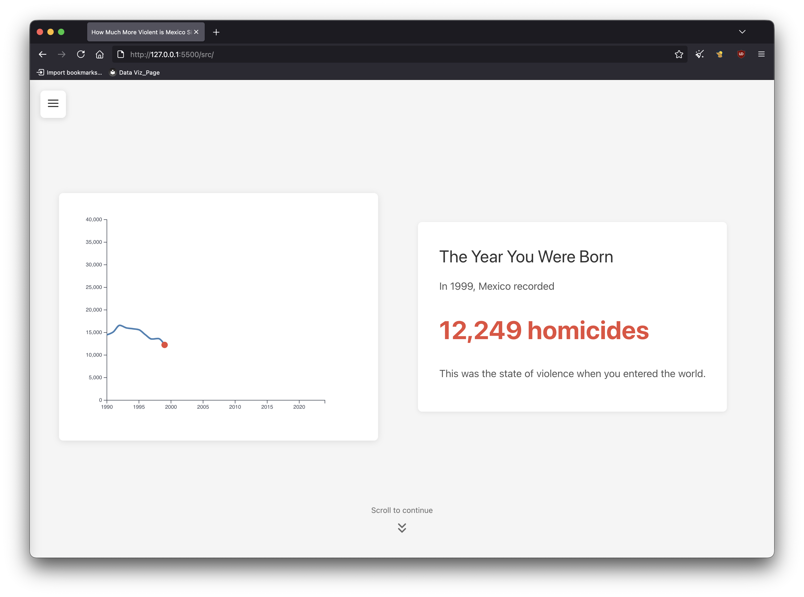
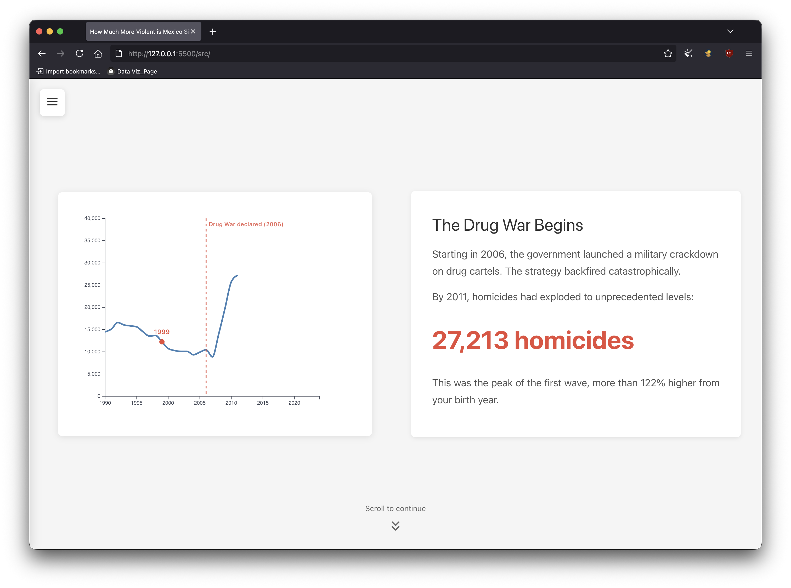
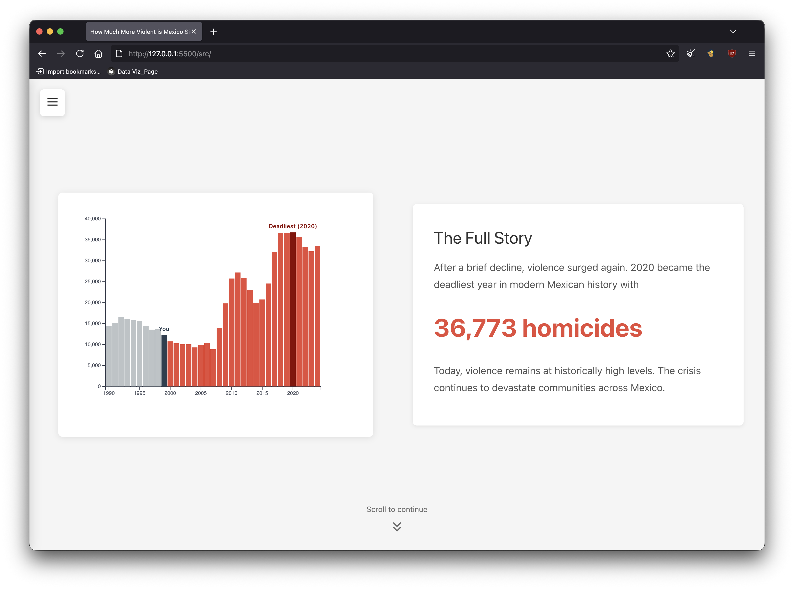
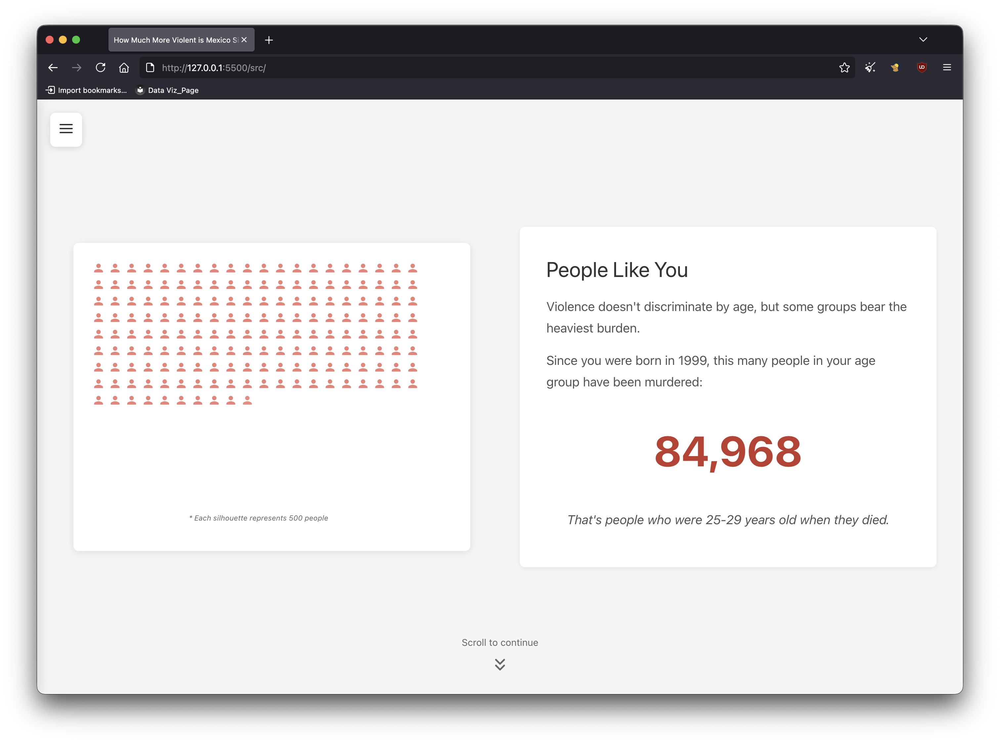
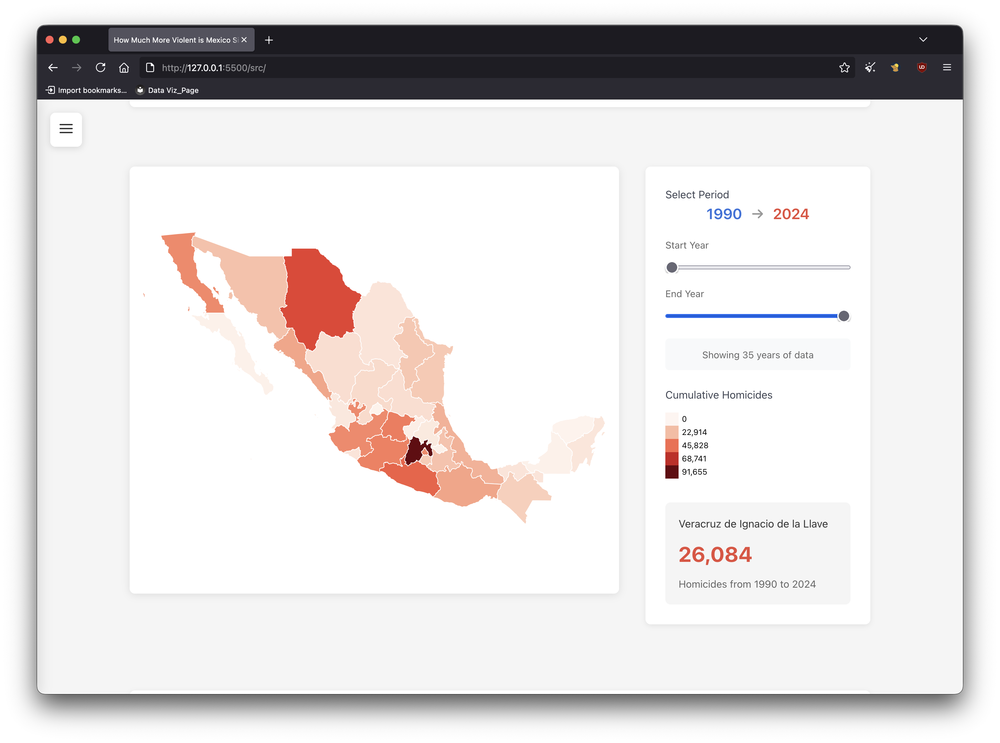

# How Much More Violent is Mexico Since You Were Born?

Chema Gálvez

Visit the page at: https://mexico-violence-in-your-lifetime.b-cdn.net/

## Description

The idea behind this project is to create a personalized narrative of the amount of homicides in Mexico
since the user was born and finalizing with an exploratory choropleth where the user can select a timeframe
to see the amount of homicides in the selected state and also the Top 5 municipalities where these occured.

The main focus of this page is not to work per se as a research website, rather an impactful and not sensasionalist
narrative of what's been happening in Mexico for years now. As a reminder for all Mexicans to not normalize this
violence and to dimension the impact it has had in the whole country

Focus on personalization to create a narrative that the user can feel close to. Do not normalize for states so users can
see the raw number, trying to get that feeling/reminder that every digit is a person, not just a statistic 

I wanted to avoid:
1) Gamefication of the topic/page. I feared too much interactivity or or toggles would lead to some 
users to just play around with the toggles and that they will lose track of the narrative, thus I limited interactivty
in the first half of the page.
2) Sensacionalist or political bias. I did not want to make this a story about presidents or political parties, this problem
has been happening for years now under different parties.

There are some edge cases like people borned before 1990 where there's not data so I changed some wording for those users
with an if clause and added an exclusive Age-range toggle in the "People Like You" section 

Other case is people who select 2024 where I also changed some wording so the narrative makes sense, instead of "since your were born"
it's changed towards "the world you inherited"

Screenshots of page:

## Next Steps
- I want to add in the choropleth the option to see the data per capita. Altough as I mentioned it was/is not in my scope
I did get the feedback or request to see that option so I think is just wise to heard these requests and add it
- Build the option to display the website in Spanish

## Data Sources

[INEGI - Mortalidad: Conjunto de datos: Defunciones por homicidios](https://www.inegi.org.mx/sistemas/olap/proyectos/bd/continuas/mortalidad/defuncioneshom.asp?s=est)
